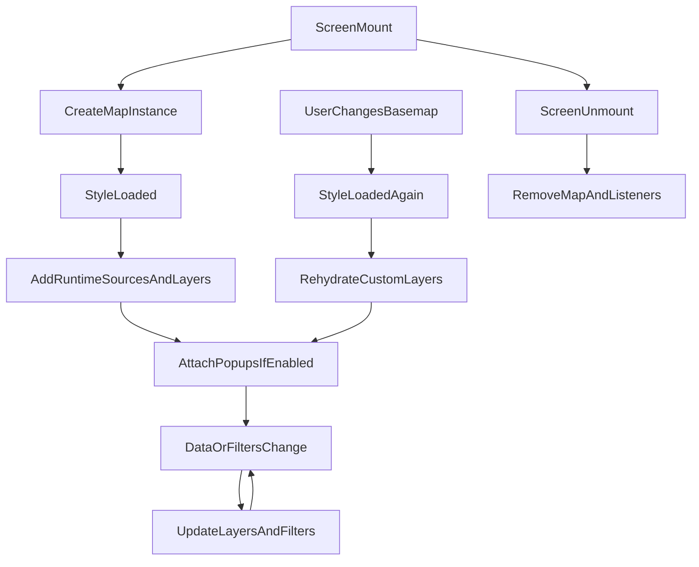

# Map module (Mapbox)

This folder contains the TerraMatch map UI: vector tiles (GeoServer), GeoJSON overlays, Mapbox Draw, popups, media markers, and dashboard overlays.

## Purpose and scope

- **In scope:** Map rendering, layer orchestration, draw/edit flows, camera, basemap switching, overlays, and integration with `MapAreaContext` / `SitePolygonData` where used by consumers.
- **Out of scope:** Backend polygon APIs, GeoServer configuration, and business rules for who may approve polygons (those live in connections and admin flows).

## Version target

| Target              | Notes                                                                   |
| ------------------- | ----------------------------------------------------------------------- |
| **Mapbox GL JS v2** | Current production dependency. Refactor and contracts apply here first. |
| **Mapbox GL JS v3** | Future upgrade; run isolated PoC and CI smoke tests before merging.     |

---

## Contract format

Each contract is **behavioral**: **WHEN** [trigger] **THEN** [observable outcome].

- No implementation detail is binding: refactors may change hooks, files, or state machines as long as every contract still holds.
- No prop names, hook names, or file names inside contracts.
- IDs (`LC-1`, `PL-2`, …) are stable references for PRs, tests, and AI prompts.

---

## 1. Map lifecycle

| ID       | Contract |
| -------- | -------- |
| **LC-1** | When a map screen opens, exactly one map canvas is created and shown. When the screen closes, the canvas and all its event listeners are fully cleaned up — no memory or DOM leaks survive across navigation. |
| **LC-2** | After the basemap finishes loading, all runtime layers (polygons, overlays, centroids, borders, media) are added. If polygon data or other data has not arrived yet, those layers are added as soon as the data arrives — never before the basemap is ready. |
| **LC-3** | When the user changes basemap (Street, Satellite, Google Satellite), every custom layer and overlay reappears on the new basemap without data loss or visual flash. |
| **LC-4** | Every event listener attached to the map is removed when its owning effect is cleaned up or when the screen closes. No persistent global listener registries survive across map instances. |

---

## 2. Polygon tile layers (GeoServer)

| ID       | Contract |
| -------- | -------- |
| **PL-1** | After site polygon data arrives and is grouped by status (draft, submitted, approved, needs-more-information, form-polygons), vector tile layers show each group with its designated color and style. |
| **PL-2** | When polygon data changes (new polygon created, polygon deleted, status changed, shapefile uploaded), tile layers refresh to show current state. |
| **PL-3** | When polygons exist for a site or project, the empty-state message is hidden. When no polygons exist, the empty-state message is shown. *(Product decision pending: show a loading indicator while polygon data is fetching.)* |
| **PL-4** | On the dashboard map, polygon layers are only visible above zoom level 9. On non-dashboard maps, no dashboard zoom threshold is applied. |
| **PL-5** | When a dashboard user does not have access to a specific project, polygon layers for that project are empty — no polygon geometry is exposed. |

---

## 3. Popups and click interactions

| ID       | Contract |
| -------- | -------- |
| **PP-1** | When a user clicks a polygon, a popup appears showing polygon metadata. Admin and site screens show the admin-style popup; dashboard screens show the dashboard-style popup. |
| **PP-2** | When a user clicks a new polygon while another popup is open, the previous popup closes before the new one opens. |
| **PP-3** | On mobile viewports or on the dashboard map, polygon clicks trigger a bottom-sheet panel instead of a floating map popup. |
| **PP-4** | While the user is actively drawing a new polygon, clicking on an existing polygon does not open any popup. |

---

## 4. Draw / edit / create flows

| ID       | Contract |
| -------- | -------- |
| **DE-1** | When drawing mode is enabled, the map cursor changes to a crosshair. When drawing mode is disabled, the cursor returns to the default pointer. |
| **DE-2** | When the user finishes drawing a new polygon, it is saved to the backend (as a site polygon or a project polygon depending on the context). On success, the tile layers refresh to include the new polygon. |
| **DE-3** | When the user begins editing a selected polygon, that polygon's geometry is loaded into the draw tool and the tile layer stops showing that polygon — preventing a visual duplicate. |
| **DE-4** | When the user saves an edited site polygon, a new version is created on the backend. On success: the draw tool clears, tile layers refresh, the side panel shows the newly active version, and a success message appears. |
| **DE-5** | When the user saves an edited project-pitch polygon, the geometry is updated on the backend. On success: the draw tool clears and the layers show the updated geometry. In form-wizard mode, the panel stays open after saving. |
| **DE-6** | When the user cancels an edit, the draw tool clears, the original polygon reappears in the tile layer, and no request is made to the backend. |
| **DE-7** | When the user previews a polygon version from the version history, a dashed-outline overlay appears for that version. Selecting a different version removes the previous overlay before adding the new one. |

---

## 5. Camera and zoom

| ID       | Contract |
| -------- | -------- |
| **CZ-1** | When the map is set to auto-fit and a bounding box is available for the active entity, the map animates to show the full bounding box with padding. |
| **CZ-2** | When a specific viewport position (center + zoom level) is provided, the map moves to it only if the position differs meaningfully from the current view — preventing infinite-loop camera updates when two maps share position state. |
| **CZ-3** | When a polygon is selected from a side panel, the map zooms to that polygon's bounding box. |
| **CZ-4** | When a geolocated point (lat/lng) is provided — for example from a geotagged image — a marker is placed and the map zooms to that location. |
| **CZ-5** | The reset-view button returns the camera to the original bounding box or center/zoom position. |

---

## 6. Basemap style

| ID       | Contract |
| -------- | -------- |
| **BS-1** | Dashboard maps open in Street style by default. Non-dashboard maps open in Satellite style by default, unless a specific style is explicitly set. |
| **BS-2** | When a project is selected on the dashboard, the basemap switches to Satellite — unless the user has already manually changed the style in that session. |
| **BS-3** | When Google Satellite mode is active, raster tiles overlay the Street basemap and conflicting base layers are hidden. When the user leaves Google Satellite mode, those hidden layers are restored. |
| **BS-4** | When a dashboard map and its companion modal map are displayed together, a style change applied to either one propagates to the other through the shared style callback. |

---

## 7. Overlays (country borders, landscapes, ANR plots)

| ID       | Contract |
| -------- | -------- |
| **OV-1** | When a country filter is active on the dashboard map, that country's border is highlighted. When the filter is cleared, the border is removed. *(Country border layer is wired via `ContentOverview` → `selectedCountry` → `Map.tsx` → `addBorderCountry`. Confirmed reachable.)* |
| **OV-2** | When landscape filters are selected, their borders highlight on the map. When filters are cleared, borders are removed. |
| **OV-3** | When ANR plot data is available and the ANR overlay is enabled, plot geometries render with fill and line layers and support click popups. When the overlay is disabled, all ANR geometry is removed. |
| **OV-4** | All overlays (borders, ANR) reappear automatically after the user switches basemap style. |

---

## 8. Media (geotagged images)

| ID       | Contract |
| -------- | -------- |
| **MD-1** | When geotagged media is provided, pulsing dot markers appear at each image location on the map. |
| **MD-2** | Clicking a media marker opens a popup with actions: preview, download, delete, and set as cover photo. |
| **MD-3** | Media markers always render on top of polygon layers. |
| **MD-4** | When the media list changes, the map markers update to reflect the new list. |

---

## 9. Checkbox selection and bulk operations

| ID       | Contract |
| -------- | -------- |
| **CB-1** | When polygons are selected via checkboxes in the side panel, those polygons show a distinct "selected for bulk action" style (red overlay) on the map. |
| **CB-2** | Bulk processing controls appear when at least one polygon is checkbox-selected. |

---

## 10. Download

| ID       | Contract |
| -------- | -------- |
| **DL-1** | When the user triggers a polygon download on a site, all polygon geometries for that site are fetched and delivered as a GeoJSON file. |
| **DL-2** | When triggered in a project-pitch context, project polygons are downloaded instead of site polygons. |
| **DL-3** | While a download is in progress, the download button shows a loading state and cannot be triggered a second time. |

---

## 11. Fullscreen

| ID       | Contract |
| -------- | -------- |
| **FS-1** | Toggling fullscreen expands the map container to fill the browser viewport; toggling again restores the original layout. |
| **FS-2** | After a fullscreen change, the map redraws to fill the new container size — no blank or misaligned areas. |
| **FS-3** | The fullscreen control is visible only on maps where the product explicitly shows it (non-dashboard surfaces). |

---

## 12. Map context modes

These contracts describe how the map adapts to the context it is used in.

| ID        | Contract |
| --------- | -------- |
| **CM-1**  | When the map is used inside a project-pitch form wizard, draw and edit controls are shown in a simplified layout. The full polygon panel, bulk validation controls, and image gallery link are hidden. |
| **CM-2**  | When a site polygon is saved in polygon-detail-view context, the detail panel stays open and the save is labeled "Updated geometry". The user is not automatically returned to a previous state. |
| **CM-3**  | When the polygon side panel is suppressed (embedded context), validation controls, bulk processing controls, the empty-state indicator, and the gallery shortcut are all hidden. Polygon tile layers still display normally. |

---

## 13. Consumer screen matrix

| Consumer | Path (approx.) | Contracts |
| -------- | --------------- | --------- |
| **OverviewMapArea** | `components/.../OverviewMapArea.tsx` | LC, PL, PP, DE, CZ, BS, OV, MD, CB, FS |
| **ContentOverview** (dashboard) | `pages/dashboard/components/ContentOverview.tsx` | LC, PL-4, PL-5, PP-3, CZ, BS-1/2/4, OV-1/2 |
| **PolygonReviewTab** (admin) | `admin/.../PolygonReviewTab/index.tsx` | LC, PL, PP, DE, CZ, MD, CB, FS |
| **RHFMap / map-input.field** | `components/.../RHFMap.tsx`, wizard field | LC, PL (form-polygons), DE-1/2/5/6, CZ, CM-1 |
| **MapField** | `admin/.../MapField.tsx` | LC, PL (form-polygons), CZ |
| **EntityMapAndGalleryCard** | `components/extensive/EntityMapAndGalleryCard/...` | LC, PL, PP, CZ, MD |
| **ModalWithMap** | `components/extensive/Modal/ModalWithMap.tsx` | LC, PL (single polygon), CZ |
| **ModalImageDetails** | `components/extensive/Modal/ModalImageDetails.tsx` | LC, CZ-4 |
| **MonitoredDataMap** | `admin/.../MonitoredDataMap.tsx` | LC, PL (approved filter), PP (view), CZ, MD |

---

## Lifecycle diagram (target mental model)



---

## Target folder structure

```text
Map-mapbox/
  README.md                     # this file — update on every PR
  Map.tsx                       # thin composition: props + hook calls + JSX (goal: ~200 lines)
  Map.d.ts                      # shared type definitions
  GeoJSON.d.ts                  # GeoJSON types
  core/
    useMapReadiness.ts          # single hook: { styleReady, styleVersion } (LC-2, LC-3, LC-4)
                                #   styleReady — true when style.load has fired
                                #   styleVersion — increments on every style.load so effects
                                #                  always re-run after style switches, not just the first
  layers/
    polygonLayers.ts            # GeoServer vector layers, filter/source management (PL)
    overlayLayers.ts            # borders, Google Satellite, ANR overlay (OV, BS-3)
    mediaLayers.ts              # pulsing-dot media markers (MD)
  interactions/
    draw.ts                     # draw mode, polygon geometry CRUD (DE)
    popups.ts                   # polygon/ANR popups, click handlers (PP)
  adapters/
    geoserver.ts                # GeoServer URL builder, ANR layer ID constants
    camera.ts                   # zoomToBbox, zoomToCenter, addMarkerAndZoom (CZ)
  hooks/
    useMap.ts                   # map instance creation; returns MapFunctions (typed in Map.d.ts)
    useMapLayers.ts             # PL contracts effect hook (gated on styleReady + styleVersion)
    useMapPopups.ts             # PP contracts effect hook (gated on sourcesAdded, stable callbacks via ref)
    useMapCamera.ts             # CZ contracts effect hook
    useMapOverlays.ts           # OV contracts effect hook (gated on styleReady + sourcesAdded)
    useMapMedia.ts              # MD contracts effect hook (gated on styleReady)
    useMapDraw.ts               # DE contracts: draw mode + edit/save/cancel
    useMapFullscreen.ts         # FS contracts
    useGoogleSatellite.ts       # (existing) Google Satellite layer toggle
    useOnHoverFeature.ts        # (existing)
    useSelectFeature.ts         # (existing)
    useConvertShapefileToGeoJson.ts  # (existing)
  MapControls/                  # (existing) UI control components
  components/                   # (existing) popup + UI components
  utils.ts                      # shrinking barrel: re-exports from domain files + download helpers
```

---

## AI contributor rules

1. **Preserve contracts.** Implementation may change freely as long as every contract still holds. Reference contract IDs in PR descriptions.
2. **One lifecycle pipeline.** Use `styleReady` and `styleVersion` from `core/useMapReadiness.ts` as the single gate for adding layers. `styleReady` tells you the style is loaded; `styleVersion` (incrementing counter) ensures effects always re-run after each style switch — include both in dependency arrays of any effect that adds sources or layers. Do not add new `isStyleLoaded()` / `idle` / rAF polling patterns.
3. **No new module-level singletons.** Map listeners and popup registries must be scoped to the map instance (use `WeakMap` or cleanup functions). See `mediaClickHandlers` in `layers/mediaLayers.ts` and `popupRegistries` in `interactions/popups.ts` as the reference pattern.
4. **Null checks.** Use `== null` / `!= null` to catch both null and undefined. Use `??` instead of `||` for defaults.
5. **DRY after boundaries.** Extract a helper only once two call sites share the same contract. Do not pre-abstract.
6. **Update this README** on every PR: move resolved appendix notes to a "resolved" section, add new files to the folder map, note which contract IDs the PR verified.
7. **Upgrade Mapbox v3** only in a dedicated PR. Only `core/useMapReadiness.ts` is expected to need changes for the readiness pipeline. Address `useMapCamera` styleReady gate and `MapFunctions` relay components as part of that PR.

---

## Testing strategy

### Manual regression checklist (run per release or after large PRs)

- [ ] Site map: load polygons, switch basemap, click polygon popup, draw new polygon, edit polygon, cancel edit
- [ ] Project map: project-pitch polygon, form wizard flow
- [ ] Dashboard: country filter border, landscape filter, project selection → Satellite switch, expand modal
- [ ] Polygon review tab (admin): bulk checkbox selection, process polygons
- [ ] Form map (RHFMap): draw, save, re-edit
- [ ] Media on map: geotagged images appear, click opens popup
- [ ] Fullscreen: expand and collapse, map resizes correctly
- [ ] Style switch × 3: layers reappear each time
- [ ] Draw → save → cancel → re-draw: no duplicate geometry on tile layer

### Smoke test before merge (run manually)

Before opening a PR that touches `core/useMapReadiness.ts`, `hooks/useMapLayers.ts`, or any layer-add function, verify these critical paths:

| Scenario | Contract IDs |
| -------- | ------------ |
| Load site with polygons → switch Street → Satellite → Google Satellite → Street (× 2 full cycles) | LC-3, OV-4, BS-3 |
| Switch to Google Satellite: raster tiles appear as basemap, polygons render on top, "© Google" attribution shows | BS-3, PL-1 |
| Switch away from Google Satellite: Street/Satellite layers restore, attribution gone | BS-3, LC-3 |
| Click polygon popup, switch style, click again — popup works on new style | PP-1, LC-3 |
| Draw → save → cancel → re-draw: no duplicate geometry | DE-2, DE-3, DE-6 |
| Edit polygon → cancel → layers restore (tests `addFilterOfPolygonsData`) | DE-6 |
| Refresh media data 3× → only one popup fires per marker click (tests WeakMap fix) | MD-2, LC-4 |
| Dashboard: country filter border, project selection → auto-Satellite switch | OV-1, BS-2 |
| Mount/unmount map screen × 3: no console errors or orphan listeners | LC-1, LC-4 |

### Contract traceability

For each PR, note in the description: which contract IDs were touched, and how they were verified (manual checklist item, PoC test, or both).

---

## Product-level rules (reviewers — fill in)

| Topic | Rule / threshold | Owner |
| ----- | ---------------- | ----- |
| Roles who see dashboard polygon layers | | |
| Max polygons before performance degrades | | |
| Mobile-specific behavior differences | | |
| Loader UX while polygon data is fetching (PL-3) | | |

---

## Appendix: Current implementation notes (non-binding)

These describe today's code. Refactors should replace them, not copy them.

- **GeoServer cache busting (pending fix):** Tile URLs include `RND=Math.random()`. Target: deterministic invalidation tied to data update events.
- **`Map.tsx` size (in progress):** Currently ~580 lines. Target ~200 lines. Next: extract style sync into `useMapStyle` and download helpers into `useMapDownload`.
- **`MapFunctions` in relay components (follow-up):** 8 intermediate components outside `Map-mapbox/` still type `mapFunctions` as `any`. Safe to migrate in a separate cleanup PR — the source (`useMap()`) and sink (`Map.tsx`) are correctly typed.
- **`useMapCamera` styleReady gate (deferred to v3):** `zoomToBbox`/`zoomToCenter` are called without a `styleReady` guard. In Mapbox v2, `fitBounds`/`flyTo` queue camera moves safely before style load. Address in the v3 upgrade PR.

## Resolved implementation notes

- **Readiness pipeline (resolved):** The mix of `isStyleLoaded()`, `loaded()`, `style.load`, `idle`, and rAF polling was replaced by a single `core/useMapReadiness.ts` → `styleReady` + `styleVersion` signals. `styleVersion` (an incrementing counter) ensures all hooks re-run after every style switch, not just the first load — fixing a silent LC-3 regression where layers weren't re-added after the second style change.
- **rAF polling in `addPolygonCentroidsLayer` (resolved):** 180-frame `requestAnimationFrame` loop removed. Direct call, gated on `styleReady`.
- **rAF polling in `useGoogleSatellite` (resolved):** 180-frame loop removed. `addGoogleSatelliteLayer()` is called directly (style guaranteed loaded by `styleReady` gate). Attribution DOM query uses `setTimeout(50ms)` — the only part that genuinely needed a delay, because `.mapboxgl-ctrl-attrib-inner` is rendered asynchronously by Mapbox's attribution control.
- **Popup singletons (resolved):** `popupAttachedMap` and `activeClickHandlers` converted to `WeakMap`-scoped registries in `interactions/popups.ts`. Each map instance gets its own state.
- **Popup/layer coupling (resolved):** Popup registration extracted into `hooks/useMapPopups.ts`. Callbacks stabilized via `useRef` to prevent re-registration on parent re-renders.
- **Media click handler leak (resolved):** `WeakMap` registry in `mediaLayers.ts` stores and removes the click handler before each re-add.
- **`addFilterOfPolygonsData` listener accumulation (resolved):** Dead `style.load`/`load` defensive branch removed. Called only from `onCancel` (user interaction), style is always loaded at that point.
- **`utils.ts` (resolved):** Originally 1975 lines → 241-line re-export barrel.
- **Dead code removed (resolved):** `addHoverEvent` deleted. `useMap.ts` public API trimmed to the 8 fields Map.tsx actually uses.
- **Type safety (resolved):** `MapFunctions` interface in `Map.d.ts`. `mapFunctions: any` in `MapProps` → `MapFunctions`. Pre-existing null guard bug on `addMarkerAndZoom` caught and fixed.
